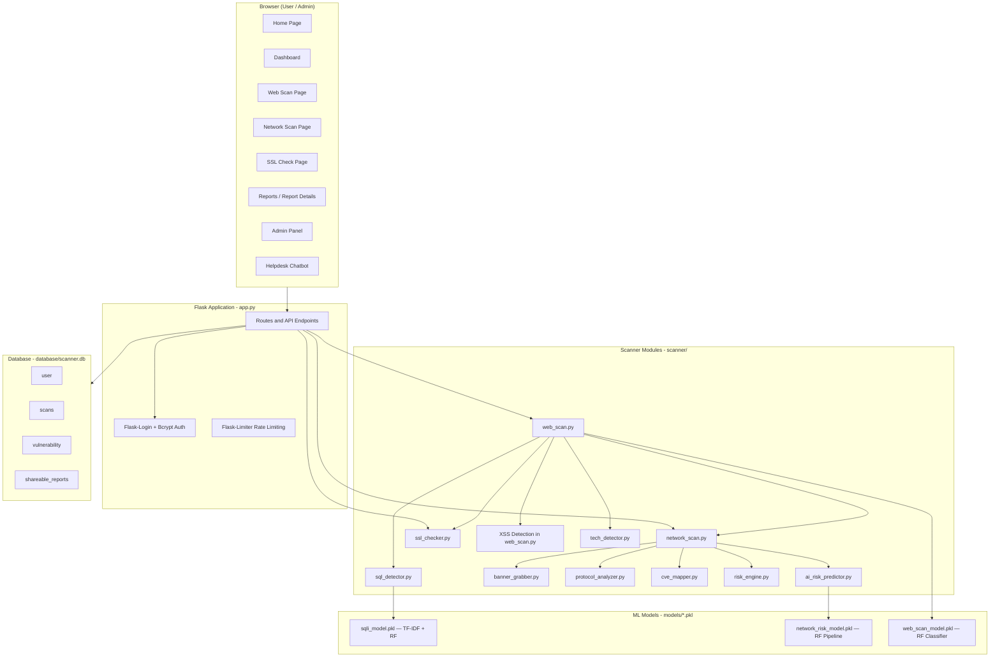
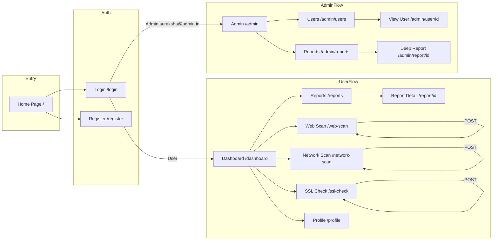
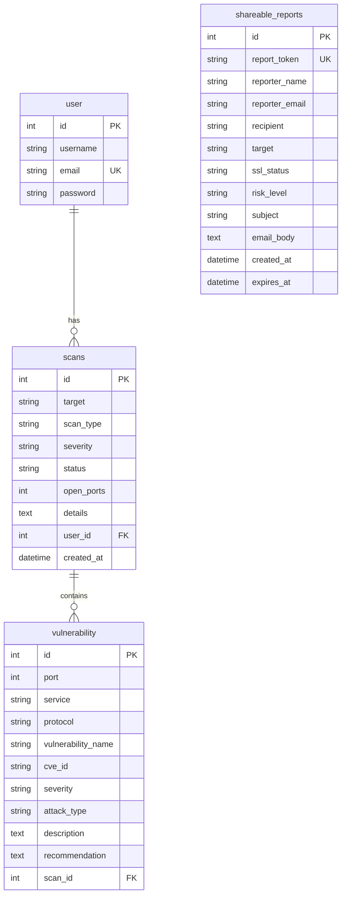
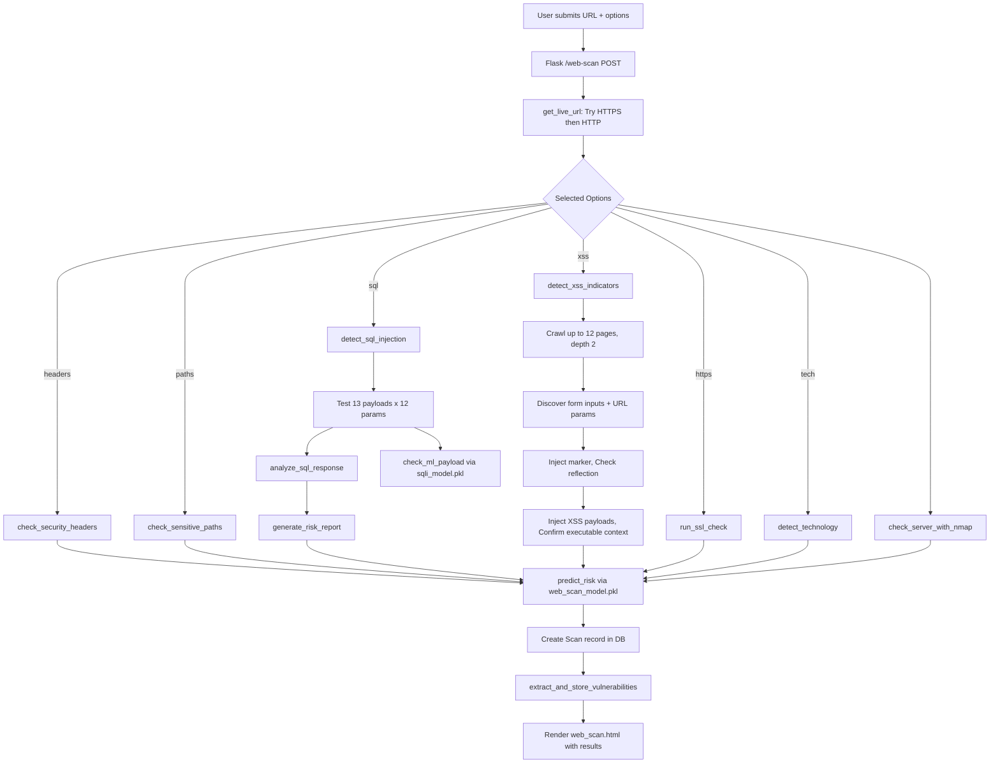
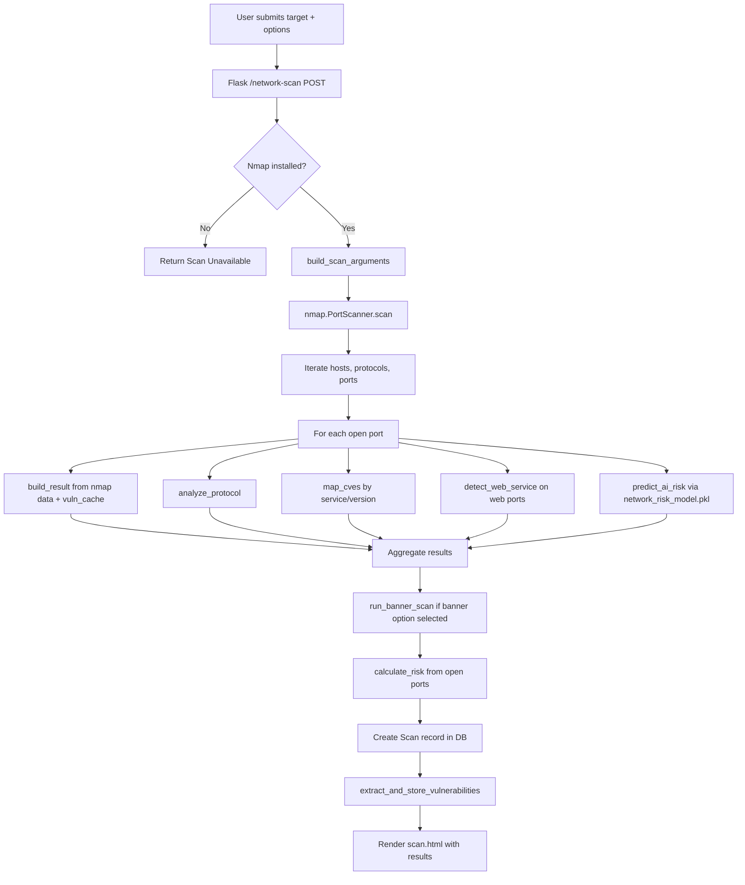

# SURAKSHA — Complete Project Analysis

> **Generated:** 01 October 2026  
> **Based On:** Actual codebase inspection — every Python module, template, model, dataset, and database schema.  
> **No code was modified.**

---

## 1. Project Identity

| Attribute | Value |
|---|---|
| **Project Name** | SURAKSHA – A Rule-Based Vulnerability Scanner with Risk Prediction |
| **Project Type** | MCA Mini Project (Major Project) |
| **Developer** | K Pranav Eswar |
| **Language** | Python 3 |
| **Backend Framework** | Flask 3.1.3 |
| **Frontend** | HTML5, CSS3, Bootstrap 5.3.3, JavaScript (inline), Chart.js |
| **Database** | SQLite (via Flask-SQLAlchemy) |
| **ML Framework** | Scikit-learn (Random Forest) |
| **External Tool** | Nmap (via python-nmap) |
| **Current Status** | Functional — all core scanning modules, ML, admin, user flows, and reporting implemented |

---

## 2. Executive Understanding

SURAKSHA is a **Flask-based web application** that lets authenticated users perform four categories of security scans against external targets:

1. **Web Vulnerability Scan** — SQL Injection detection (payload + ML), XSS detection (reflected, with crawling), security header analysis, sensitive path discovery, technology fingerprinting, server ecosystem identification (via Nmap), and HTTPS/TLS validation.
2. **Network Scan** — Nmap-based port scanning, service/version/OS detection, banner grabbing, protocol-level risk analysis, CVE mapping from a built-in database, and ML-based per-port risk prediction (Random Forest).
3. **SSL/TLS Analysis** — Certificate validation, TLS version checking, cipher analysis, expiry tracking, risk scoring, and automated contact-discovery + email advisory generation.
4. **Unified Full Assessment** — Combines web + network + SSL scans into a single assessment with aggregated risk scoring.

An **admin panel** (email-hardcoded: `suraksha@admin.in`) provides cross-user scan monitoring, vulnerability drill-down, user management, and PDF statement export.

All scan results are stored in SQLite, connected to users. Vulnerabilities are extracted from scan details and stored in a normalised `vulnerability` table. A helpdesk chatbot (static decision-tree, not AI-generated) is served via a JSON API.

---

## 3. Actual Architecture



**Architecture Classification:** This is a **server-rendered monolithic Flask application** with limited API-style JSON routes (primarily for admin AJAX popups, helpdesk chatbot, shareable report CRUD, and the unified assessment endpoint). It is **NOT** a fully API-driven SPA.

---

## 4. Complete Project Structure

```
SURAKSHA/
├── app.py                          # Main Flask app — ALL routes, config, vuln sync (1355 lines)
├── requirements.txt                # Python dependencies
├── migrate.py                      # One-off migration script for shareable_reports
├── script.py                       # One-off template patch script
├── test.py                         # DB schema inspector utility
├── check.md                        # Test target URLs / demo order notes
├── ABSTRACT.md                     # Project abstract document
├── README.md                       # Project README with installation & feature list
│
├── ai/
│   └── helpdesk_ai.py              # Static helpdesk decision-tree (dict-based, not AI)
│
├── scanner/
│   ├── web_scan.py                 # Web scan orchestrator + XSS detection (555 lines)
│   ├── network_scan.py             # Nmap-based network scanner (138 lines)
│   ├── ssl_checker.py              # SSL/TLS checker + email report builder (390 lines)
│   ├── sql_detector.py             # SQL injection detection + ML check (127 lines)
│   ├── sql_payloads.py             # SQLi payload definitions (4 categories)
│   ├── sql_analyzer.py             # SQLi response analysis (error/reflection/boolean/time)
│   ├── sql_risk.py                 # SQLi risk scoring + recommendations
│   ├── tech_detector.py            # Technology fingerprinting (405 lines)
│   ├── protocol_analyzer.py        # Protocol risk lookup database
│   ├── cve_mapper.py               # Static CVE correlation database
│   ├── banner_grabber.py           # Socket-based banner grabbing
│   ├── scan_builder.py             # Nmap argument construction
│   ├── result_parser.py            # Nmap result parsing
│   ├── risk_engine.py              # Port-based risk scoring
│   ├── ai_risk_predictor.py        # ML network risk predictor (loads RF model)
│   ├── waf_detector.py             # WAF/CDN detection (exists but NOT called from any scan)
│   ├── web_service_detector.py     # Web service detection on open ports
│   ├── signatures.json             # Security headers, paths, patterns config
│   └── training.json               # Web scan ML training data (~216KB)
│
├── models/
│   ├── __init__.py                 # SQLAlchemy db instance
│   ├── user_model.py               # User ORM model
│   ├── scan_model.py               # Scan ORM model
│   ├── vulnerability_model.py      # Vulnerability ORM model
│   ├── shareable_report_model.py   # ShareableReport ORM model
│   ├── trainer.py                  # Web scan ML model trainer
│   ├── sqli_model.pkl              # Trained SQLi ML model (~2.1MB)
│   ├── network_risk_model.pkl      # Trained network risk ML model (~1.7MB)
│   └── web_scan_model.pkl          # Trained web scan risk ML model (~5.1MB)
│
├── ml/
│   ├── train_sqli_model.py         # SQLi model training code
│   ├── train_network_model.py      # Network risk model training code
│   ├── network_predictor.py        # Standalone network risk predictor
│   └── compare_models.py           # Model comparison script
│
├── datasets/
│   ├── sqli.csv                    # SQLi dataset (4200 rows, UTF-16, Sentence/Label)
│   ├── network_risk_dataset.csv    # Network risk dataset (5000 rows, 8 columns)
│   ├── data.csv                    # Web scan risk dataset (1000 rows, 7 features)
│   └── ports_security.csv          # Port/service/vulnerability reference (43 rows)
│
├── templates/                      # 16 Jinja2 HTML templates
│   ├── home.html                   # Landing page (1261 lines, full inline CSS/JS)
│   ├── login.html                  # Login page
│   ├── register.html               # Registration page
│   ├── dashboard.html              # User dashboard (669 lines)
│   ├── scan.html                   # Network scan page
│   ├── web_scan.html               # Web scan page (45087 bytes)
│   ├── ssl_check.html              # SSL checker page
│   ├── reports.html                # User reports list
│   ├── report_details.html         # Individual scan report view
│   ├── profile.html                # User profile
│   ├── admin.html                  # Admin dashboard
│   ├── users.html                  # Admin user management
│   ├── view_user.html              # Admin view specific user
│   ├── statement.html              # Admin reports/statement view
│   ├── deep_reports.html           # Admin deep report view
│   └── rate_limit.html             # Rate limit error page
│
├── database/
│   └── scanner.db                  # SQLite database file (40KB)
│
└── venv/                           # Python virtual environment
```

---

## 5. Application Flow



---

## 6. Flask Routes

### Page Routes (Server-Rendered HTML)

| Route | Methods | Auth | Function | Template |
|---|---|---|---|---|
| `/` | GET | No | `home()` | `home.html` |
| `/login` | GET, POST | No | `login()` — rate limited 5/min | `login.html` |
| `/register` | GET, POST | No | `register()` | `register.html` |
| `/dashboard` | GET | Yes | `dashboard()` | `dashboard.html` |
| `/web-scan` | GET, POST | Yes | `web_scan()` | `web_scan.html` |
| `/network-scan` | GET, POST | Yes | `network_scan()` | `scan.html` |
| `/ssl-check` | GET, POST | Yes | `ssl_check()` | `ssl_check.html` |
| `/reports` | GET | Yes | `reports()` — search/filter | `reports.html` |
| `/report/<int:scan_id>` | GET | Yes | `report_details()` — user-scoped | `report_details.html` |
| `/profile` | GET | Yes | `profile()` | `profile.html` |
| `/admin` | GET | Yes | `admin()` | `admin.html` |
| `/admin/users` | GET | Yes (admin) | `admin_users()` | `users.html` |
| `/admin/user/<int:user_id>` | GET | Yes (admin) | `view_user()` | `view_user.html` |
| `/admin/reports` | GET | Yes (admin) | `admin_reports()` | `statement.html` |
| `/admin/report/<int:scan_id>` | GET | Yes (admin) | `deep_report()` | `deep_reports.html` |
| `/assessment` | GET | Yes | `assessment()` | `assessment.html` (**template file does not exist**) |
| `/logout` | GET | Yes | `logout()` | Redirects to `/login` |

### API / JSON Routes

| Route | Methods | Auth | Purpose | Rate Limit |
|---|---|---|---|---|
| `/helpdesk` | GET, POST | No | Helpdesk chatbot responses | Default |
| `/check-nmap` | GET | No | Check if Nmap is installed | Default |
| `/block-ip` | POST | No | Stub — returns "blocked" message, no actual blocking | Default |
| `/update-profile` | POST | Yes | Update username/password | Default |
| `/report-ssl` | POST | Yes | Build SSL advisory email report | 20/min |
| `/api/run-assessment` | POST | Yes | Run unified full assessment | Default |
| `/api/reports` | POST | No | Create shareable report | 10/min |
| `/api/reports/<token>` | GET | No | Get shareable report by token | 30/min |
| `/api/send-report-email` | POST | No | Send report email via SMTP | 10/min |
| `/api/user/<int:user_id>` | GET | Yes (admin) | Get user details JSON | Default |
| `/admin/delete-user/<int:user_id>` | GET | Yes (admin) | Delete user + their scans | Default |
| `/admin/api/reports/<int:scan_id>` | GET | Yes (admin) | Get scan details JSON | Default |
| `/admin/api/vulnerabilities/<int:vuln_id>` | GET | Yes (admin) | Get vulnerability details JSON | Default |
| `/admin/export-statement` | GET | Yes (admin) | Export PDF statement | Default |
| `/assessment-result/<int:scan_id>` | GET | Yes | Assessment result page (**template does not exist**) | Default |

> **Key Finding:** The project is **primarily server-rendered** (Jinja2 templates). API-style JSON routes exist for admin AJAX operations, the helpdesk chatbot, shareable report management, the unified assessment endpoint, and the SSL email advisory flow.

---

## 7. Authentication & Authorization

| Aspect | Implementation |
|---|---|
| **Library** | Flask-Login + Flask-Bcrypt |
| **Password Storage** | bcrypt hashed |
| **Session Management** | Flask-Login session cookies |
| **Admin Detection** | Hardcoded email check: `current_user.email == "suraksha@admin.in"` |
| **Admin Default Credentials** | Username: `admin`, Email: `suraksha@admin.in`, Password: `admin123` (created at startup) |
| **Login Rate Limiting** | 5 attempts per minute (Flask-Limiter) |
| **IP Blocking** | In-memory `blocked_ips` set — suspicious input patterns (SQLi, XSS in login fields) cause IP ban for session lifetime |
| **Login Redirect Logic** | Admin email → `/admin`; all others → `/dashboard` |
| **Role Column** | Not present in database; admin is identified solely by email |

> **Limitation:** Admin authorization relies on email string matching, not a database role field. The `blocked_ips` set is in-memory and resets on application restart.

---

## 8. Web Vulnerability Scanner

### Orchestration

`run_web_scan()` in `scanner/web_scan.py` orchestrates all sub-modules. Users select scan options from the form: `headers`, `paths`, `sql`, `xss`, `https`, `tech`.

### SQL Injection Detection

| Aspect | Implementation |
|---|---|
| **Entry Point** | `detect_sql_injection(url)` in `sql_detector.py` |
| **Target Parameters** | 12 hardcoded: `id, uid, user, userid, page, cat, category, search, q, query, item, product` |
| **Payload Categories** | Error-based (4), Boolean-based (4), Union-based (3), Time-based (2) — total 13 payloads |
| **Detection Method** | Each payload is appended to each parameter. The response is compared to the normal baseline. |
| **Response Analysis** | `sql_analyzer.py` checks: SQL error strings (26 patterns for MySQL/PostgreSQL/SQLite/Oracle/MSSQL), payload reflection, HTTP status change, response length change (>300 byte threshold), boolean response differences, time delay (>=4s) |
| **ML Involvement** | `sqli_model.pkl` (TF-IDF char n-grams + Random Forest) classifies each payload string as SQL injection (1) or benign (0). ML result is **added as a supplementary finding**, NOT used as the sole detector. ML confidence is appended to the findings list. |
| **Risk Scoring** | `sql_risk.py`: Weighted scoring (SQL Error=5, Boolean Diff=5, Time Delay=6, Length Changed=4, Reflection=3, Status Changed=2). Score >=15=Critical, >=10=High, >=5=Medium, else Low. Confidence = min(score*10, 100). |
| **Final Output** | `{issue, severity, confidence, score, parameters, payloads, findings, recommendation}` |

### XSS Detection

| Aspect | Implementation |
|---|---|
| **Entry Point** | `detect_xss_indicators(url)` in `web_scan.py` (lines 373-422) |
| **Crawling** | BFS crawl: max 12 pages, depth 2, same-origin only |
| **Input Discovery** | URL query parameters + GET form fields; search-related parameters prioritised |
| **Detection Method** | 1) Inject unique marker (`SURAKSHA_XSS_<hex>`) into each parameter. 2) Check if marker is reflected in response. 3) If reflected, inject 5 XSS payloads (svg/onload variants, script injection, javascript: URI). 4) Confirm the payload lands in an **executable HTML context** (event handler, script block, or javascript: URL), not just plain text. |
| **Context Verification** | `_confirm_executable_context()` uses regex to ensure the injected payload appears inside a `<script>`, event handler attribute, or `javascript:` URL — and is NOT inside a non-executable container (comment, `<textarea>`, `<title>`, `<style>`, `<xmp>`, `<plaintext>`). |
| **Severity** | Hardcoded to "High" for all confirmed findings |
| **ML Involvement** | None for XSS detection specifically |

### Security Headers

| Aspect | Implementation |
|---|---|
| **Method** | `check_security_headers()` checks response headers against 7 defined headers from `signatures.json` |
| **Headers Checked** | X-Frame-Options, Content-Security-Policy, Strict-Transport-Security, X-Content-Type-Options, Referrer-Policy, Permissions-Policy, Access-Control-Allow-Origin |
| **Output** | Dict: `{header: "Present"/"Missing"}` |

### Sensitive Paths

| Aspect | Implementation |
|---|---|
| **Method** | `check_sensitive_paths()` sends GET requests to 20 predefined paths from `signatures.json` |
| **Paths Checked** | /admin, /administrator, /login, /dashboard, /config, /backup, /db, /database, /phpmyadmin, /server-status, /robots.txt, /sitemap.xml, /.env, /.git, /wp-admin, /wp-login.php, /api, /graphql, /swagger, /debug |
| **Detection** | HTTP 200, 301, or 302 response = path found |

### Technology Detection

| Aspect | Implementation |
|---|---|
| **Module** | `tech_detector.py` — `TechDetector` class (405 lines) |
| **Method** | Analyses HTTP headers, cookies, HTML meta tags, script URLs, stylesheet URLs, and HTML attributes/patterns against signature databases |
| **Technologies Detected** | React, Next.js, Vue.js, Nuxt.js, Angular, Svelte, jQuery, Bootstrap, Tailwind CSS, Laravel, Django, Flask, Express.js, Node.js, Spring, ASP.NET, Ruby on Rails, PHP, WordPress, Drupal, Joomla, Google Analytics, Google Tag Manager, Facebook Pixel |
| **CDN/WAF Detection** | Cloudflare, AWS CloudFront, AWS WAF, Sucuri, Imperva, Akamai |
| **Server Detection** | Nginx, Apache, Microsoft IIS, LiteSpeed |
| **Confidence Threshold** | Minimum 60% confidence for inclusion |

### HTTPS / TLS Check (within Web Scan)

Calls `run_ssl_check()` from `ssl_checker.py` as part of web scan when `https` option is selected.

### Server Ecosystem (within Web Scan)

Calls `run_network_scan()` with `[os, version]` options to detect server OS via Nmap.

### Web Scan Risk Prediction

| Aspect | Implementation |
|---|---|
| **Function** | `predict_risk()` in `web_scan.py` |
| **Input Features** | `[missing_headers, paths_count, sql_payload_count, xss_count, https_penalty, server_known]` |
| **ML Model** | `web_scan_model.pkl` — RandomForestClassifier (200 trees, max_depth=10). Output: 0=Low, 1=Medium, 2=High, 3=Critical |
| **Fallback** | If model unavailable: score = missing_headers + (paths*2) + (sql*5) + (xss*4). Score >=15=Critical, >=10=High, >=5=Medium, else Low |
| **Final Risk** | `max(model_risk, xss_risk)` — the higher of ML prediction and highest XSS finding severity |

---

## 9. Network Scanner

| Aspect | Implementation |
|---|---|
| **Entry Point** | `run_network_scan(target, scan_options)` in `network_scan.py` |
| **Tool** | python-nmap wrapping system Nmap installation |
| **Prerequisite** | Nmap must be installed and in PATH; checked via `shutil.which("nmap")` |
| **Scan Options** | `port`, `banner`, `service`, `version`, `os`, `vuln`, `full` |
| **Base Arguments** | `-Pn -T3 --host-timeout 60s --max-retries 2 -sS` (always SYN scan) |
| **Port Range** | `full` → `-p-`; `port` → `--top-ports 5000`; default → `--top-ports 1000` |
| **Service Detection** | `-sV --version-light` (service) or `-sV --version-all` (version) |
| **OS Detection** | `-O --osscan-limit` |
| **Vuln Scripts** | `--script=vuln --script-timeout 15s` |
| **Per-Port Processing** | Each open port gets: result_parser → protocol_analyzer → cve_mapper → web_service_detector → ai_risk_predictor |
| **Banner Grabbing** | Socket-based (separate from Nmap): sends `HEAD / HTTP/1.0\r\n\r\n`, reads 4096 bytes, timeout 3s |
| **Overall Risk** | `risk_engine.py`: Critical ports (21,22,23,25,445,1433,3306,3389,5432,6379,27017) score 2 each, others 1. Total >=8=Critical, >=4=Medium, else Low |

---

## 10. SSL/TLS Analyzer

| Aspect | Implementation |
|---|---|
| **Entry Point** | `run_ssl_check(target)` in `ssl_checker.py` |
| **Method** | Python `ssl` and `socket` libraries — creates TLS connection to port 443 |
| **Certificate Data Extracted** | Issuer, Subject (issued_to), Expiry date, Days remaining |
| **TLS Data** | TLS version, Cipher suite, Hash algorithm (extracted from cipher name) |
| **Risk Scoring** | `calculate_ssl_risk()`: Invalid SSL=+5, Weak TLS (TLSv1/1.1/SSLv2/SSLv3)=+4, Days<30=+3, Days<90=+2. Score >=7=Critical, >=3=Medium, else Low |
| **Error Handling** | On any exception: returns `ssl_valid=False, risk=Critical` |
| **Contact Discovery** | `discover_contact_email(target)`: RFC 9116 security.txt → official security/contact pages → RDAP/WHOIS → fallback `security@domain` |
| **Email Report** | `build_ssl_report_email()`: Generates professional advisory email body with all SSL findings |

---

## 11. Protocol & Banner Analysis

### Protocol Analyzer (`protocol_analyzer.py`)

Static lookup database with 20 protocol definitions. Each service gets: risk level, description, recommendation.

| Protocol | Risk |
|---|---|
| telnet, redis, mongodb | Critical |
| ftp, snmp, rdp, ms-wbt-server, netbios, microsoft-ds, smb, mysql, postgresql | High |
| http, smtp, pop3, imap, dns, ldap | Medium |
| https, ssh | Low |

### Banner Grabber (`banner_grabber.py`)

| Aspect | Implementation |
|---|---|
| **Method** | TCP socket connection, sends HTTP HEAD request, reads up to 4096 bytes |
| **Common Ports** | 21, 22, 23, 25, 53, 80, 110, 143, 443, 3306, 3389, 8080 |
| **Timeout** | 3 seconds |
| **Output** | `{port, service, banner}` — banner truncated to 300 chars |

---

## 12. CVE Mapping

| Aspect | Implementation |
|---|---|
| **Module** | `cve_mapper.py` |
| **Data Source** | Hardcoded `CVE_DATABASE` dictionary — 14 product entries |
| **Mapping Method** | Service/version string is matched against product names (case-insensitive substring match) |
| **Products Covered** | Apache Tomcat, Apache, nginx, OpenSSH, Microsoft IIS, vsftpd, ProFTPD, MySQL, PostgreSQL, Samba, Redis, MongoDB, AkamaiGHost |
| **Limitation** | Static — does not query any external CVE API. Does NOT consider version numbers for CVE applicability. Any detection of "Apache" matches regardless of version. |

---

## 13. Risk & Severity Engine

Multiple risk engines exist for different contexts:

### Network Risk Engine (`risk_engine.py`)

```
Critical Ports: {21, 22, 23, 25, 445, 1433, 3306, 3389, 5432, 6379, 27017}
Score = Sum(2 if port in critical_ports else 1) for each open port
>=8 → Critical | >=4 → Medium | else → Low
```

### SQL Injection Risk (`sql_risk.py`)

```
Weights: SQL Error=5, Boolean Diff=5, Time Delay=6, Length Change=4, Reflection=3, Status Change=2
Score = Sum(matching weights)
>=15 → Critical | >=10 → High | >=5 → Medium | else → Low
Confidence = min(score * 10, 100)
```

### SSL Risk (`ssl_checker.py`)

```
Invalid SSL=+5 | Weak TLS=+4 | Days<30=+3 | Days<90=+2
>=7 → Critical | >=3 → Medium | else → Low
```

### Web Scan Risk (`web_scan.py`)

```
ML Model prediction OR fallback formula:
Fallback: score = missing_headers + (paths * 2) + (sql * 5) + (xss * 4)
>=15 → Critical | >=10 → High | >=5 → Medium | else → Low
Final = max(model_risk, xss_risk)
```

### Admin Priority Mapping (`app.py`)

```
RISK_MAPPING = {
    "critical": {priority: "P1", score: 100},
    "high":     {priority: "P2", score: 80},
    "medium":   {priority: "P3", score: 60},
    "low":      {priority: "P4", score: 40},
    "informational": {priority: "P5", score: 20},
    "none":     {priority: "P6", score: 10}
}
```

### Detailed Risk Score (`calculate_risk_score()` in `app.py`)

```
Base: Critical=60, High=45, Medium=30, Low=15
+ Open Ports: >=10=+25, >=5=+15, >=1=+8
+ Per vulnerability: Critical=+25, High=+18, Medium=+12, else=+5
+ CVE exists: +5 per vuln with CVE
Cap at 100
```

> **Note:** `calculate_risk_score()` is defined but **not called anywhere** in the current codebase. The admin panel uses the simpler `RISK_MAPPING` lookup instead.

### Unified Assessment Risk (`/api/run-assessment`)

```
Per module: Web Critical=+35, High=+25, Medium=+15
            Network Critical=+35, High=+25, Medium=+15
            SSL Critical=+30, High=+20, Medium=+10
risk_score = min(total, 100)
highest_severity = max severity across all modules
```

---

## 14. Machine Learning

### 14.1 SQLi ML Model

| Attribute | Value |
|---|---|
| **Training Script** | `ml/train_sqli_model.py` |
| **Algorithm** | Pipeline: TF-IDF Vectorizer (char n-grams 2-5, max 10000 features) → RandomForestClassifier (200 trees, max_depth=15) |
| **Dataset** | `datasets/sqli.csv` — 4200 rows, UTF-16 encoding, columns: `Sentence`, `Label` (0=benign, 1=SQLi) |
| **Train/Test Split** | 70/30, stratified |
| **Saved Model** | `models/sqli_model.pkl` (~2.1 MB) |
| **Usage in Scanner** | `sql_detector.py` → `check_ml_payload(payload)`: Each SQL payload string is classified. If predicted as SQLi (label=1), ML confidence is appended to the findings. **ML does NOT trigger detection alone** — it supplements rule-based detection. ML result only appears in findings if rule-based analysis already found issues. |
| **Prediction Input** | Raw payload string (e.g., `"' OR 1=1--"`) |

### 14.2 Network Risk ML Model

| Attribute | Value |
|---|---|
| **Training Script** | `ml/train_network_model.py` |
| **Algorithm** | Pipeline: ColumnTransformer (OneHotEncoder for categorical + passthrough for numeric) → RandomForestClassifier (100 trees, max_depth=8) |
| **Dataset** | `datasets/network_risk_dataset.csv` — 5000 rows, columns: `port, protocol, service, version, os, open_ports, risk, category` |
| **Input Features** | port (numeric), protocol (categorical), service (categorical), version (categorical), os (categorical), open_ports (numeric) |
| **Target** | `risk` — labels: Low, Medium, High, Critical |
| **Train/Test Split** | 80/20, stratified |
| **Cross-Validation** | 5-fold |
| **Saved Model** | `models/network_risk_model.pkl` (~1.7 MB) |
| **Usage in Scanner** | `ai_risk_predictor.py` → `predict_ai_risk()`: Called per open port during network scan. Returns risk level + confidence percentage. Result stored as `ai_risk` and `confidence` per port in scan results. |
| **Impact on Severity** | ML prediction is stored per port result and displayed in UI. The overall network scan risk uses the rule-based `risk_engine.py`, NOT the ML prediction. ML predictions are displayed alongside rule-based results. |

### 14.3 Web Scan Risk ML Model

| Attribute | Value |
|---|---|
| **Training Script** | `models/trainer.py` |
| **Algorithm** | RandomForestClassifier (200 trees, max_depth=10) |
| **Dataset** | `scanner/training.json` — JSON array (~216KB). Also matches `datasets/data.csv` structure (1000 rows) |
| **Input Features** | `missing_headers, sensitive_paths, sql_indicators, xss_indicators, https_disabled, server_disclosure` |
| **Target** | `risk` — mapped to: Low=0, Medium=1, High=2, Critical=3 |
| **Train/Test Split** | 80/20 |
| **Saved Model** | `models/web_scan_model.pkl` (~5.1 MB) |
| **Usage in Scanner** | `web_scan.py` → `predict_risk()`: Called after all web scan modules complete. If model available, prediction is combined with XSS severity using max(). If model unavailable, uses rule-based fallback formula. |

### ML Summary

| Model | Used In | Role | Affects Final Severity? |
|---|---|---|---|
| SQLi Model | SQL Injection detection | Supplementary evidence — appended to findings list | Indirectly — adds to finding count, which affects score |
| Network Risk Model | Per-port risk assessment | Per-port prediction, displayed in results | Displayed but NOT used for overall network risk |
| Web Scan Model | Overall web scan risk | Primary risk predictor (with fallback) | **Yes** — directly determines web scan risk level |

---

## 15. Database Architecture

### Tables & Schema

#### `user`

| Column | Type | Constraints |
|---|---|---|
| id | INTEGER | PK, NOT NULL |
| username | VARCHAR(100) | NOT NULL |
| email | VARCHAR(120) | NOT NULL, UNIQUE |
| password | VARCHAR(255) | NOT NULL |

#### `scans`

| Column | Type | Constraints |
|---|---|---|
| id | INTEGER | PK, NOT NULL |
| target | VARCHAR(255) | NOT NULL |
| scan_type | VARCHAR(100) | NOT NULL — values: "Network", "Web", "SSL", "Full Assessment" |
| severity | VARCHAR(50) | NOT NULL — values: "Critical", "High", "Medium", "Low", "Not Evaluated" |
| status | VARCHAR(50) | Default: "Completed" |
| open_ports | INTEGER | Default: 0 |
| details | TEXT | JSON-encoded scan data |
| user_id | INTEGER | NOT NULL, FK → user.id |
| created_at | DATETIME | Default: utcnow |

#### `vulnerability`

| Column | Type | Constraints |
|---|---|---|
| id | INTEGER | PK, NOT NULL |
| port | INTEGER | NOT NULL |
| service | VARCHAR(100) | NOT NULL |
| protocol | VARCHAR(50) | |
| vulnerability_name | VARCHAR(255) | NOT NULL |
| cve_id | VARCHAR(100) | |
| severity | VARCHAR(50) | NOT NULL |
| attack_type | VARCHAR(255) | |
| description | TEXT | |
| recommendation | TEXT | |
| scan_id | INTEGER | FK → scans.id |

#### `shareable_reports`

| Column | Type | Constraints |
|---|---|---|
| id | INTEGER | PK, NOT NULL |
| report_token | VARCHAR(64) | NOT NULL, UNIQUE, default: random hex |
| reporter_name | VARCHAR(255) | |
| reporter_email | VARCHAR(255) | |
| recipient | VARCHAR(255) | |
| target | VARCHAR(255) | |
| ssl_status | VARCHAR(50) | |
| risk_level | VARCHAR(50) | |
| subject | VARCHAR(255) | |
| email_body | TEXT | |
| created_at | DATETIME | Default: utcnow |
| expires_at | DATETIME | |

### Relationships



### Database Integrity Notes

- Foreign key enforcement is **DISABLED** in SQLite (verified from test.py output)
- `user` → `scans`: user_id FK relationship with ORM backref
- `scans` → `vulnerability`: scan_id FK relationship
- `shareable_reports`: Standalone — no FK to user or scans
- Current data: 2 users, 13 scans, 8 vulnerabilities, 1 shareable report

### Vulnerability Synchronization

After each scan completes, `extract_and_store_vulnerabilities(scan)` in `app.py` parses the JSON details and creates normalised `Vulnerability` records. This covers Network (per-port vulnerabilities), Web (SQLi, XSS, missing headers), SSL (weak config), and Full Assessment (aggregated findings).

---

## 16. Reporting & Shareable Reports

### User Reports

- **List View** (`/reports`): Filterable by search term and scan type, user-scoped
- **Detail View** (`/report/<id>`): Shows full scan details, user-scoped (enforced by `user_id` filter)
- **Template**: `report_details.html` — renders scan details from JSON using Jinja2 `from_json` filter

### Admin Reports

- **Statement View** (`/admin/reports`): All scans across all users, filterable by search, type, severity, date range. Enriched with priority mappings and vulnerability data. Template: `statement.html`
- **Deep Report** (`/admin/report/<id>`): Detailed scan view. Template: `deep_reports.html`
- **PDF Export** (`/admin/export-statement`): Uses ReportLab to generate a PDF table of all scans

### Shareable Reports

- **Create** (`POST /api/reports`): Creates a `ShareableReport` with a unique token and 7-day expiry
- **Retrieve** (`GET /api/reports/<token>`): Returns report data if not expired
- **Send Email** (`POST /api/send-report-email`): Sends report email via SMTP (requires `MAIL_USERNAME`, `MAIL_PASSWORD` environment variables)
- **SSL Advisory** (`POST /report-ssl`): Builds a standardised SSL security advisory email with contact discovery

### Email Functionality

| Aspect | Implementation |
|---|---|
| **SMTP Configuration** | Environment variables: `MAIL_USERNAME`, `MAIL_PASSWORD`, `MAIL_SERVER` (default: smtp.gmail.com), `MAIL_PORT` (default: 587), `MAIL_USE_TLS` (default: True) |
| **Contact Discovery** | `discover_contact_email()` in `ssl_checker.py`: RFC 9116 security.txt → official website pages → RDAP/WHOIS → fallback |
| **Email Sending** | Standard Python `smtplib` + `email.message.EmailMessage` |
| **Used For** | SSL advisory emails and shareable report delivery |

---

## 17. Admin Functionality

| Feature | Implementation |
|---|---|
| **Admin Access** | Hardcoded email: `suraksha@admin.in` |
| **Dashboard** | Total users, total scans, critical scans count, recent scans with risk scores and priorities |
| **User Management** | List all users (searchable), view user details + their scans, delete user (cascades scan deletion) |
| **Report Management** | All scans filterable by type/severity/date/search, enriched with vulnerability data |
| **Deep Reports** | Detailed scan view with full JSON details |
| **PDF Export** | ReportLab-generated PDF table of all scans |
| **API Endpoints** | JSON endpoints for scan details, vulnerability details, user details (for AJAX modals) |

> **Note:** Admin cannot delete their own account (protected). Admin role has no database column — purely email-based.

---

## 18. Frontend/UI Flow

### Technology

- **Styling**: Bootstrap 5.3.3 (CDN) + extensive inline CSS in each template
- **Icons**: Bootstrap Icons 1.11.3 (CDN)
- **Charts**: Chart.js (CDN) — used on dashboard for severity distribution
- **Theme**: Dual-theme support (Blue Cyber / Red Black) — saved to `localStorage`, applied via CSS variables and `data-theme` attribute
- **Responsive**: Bootstrap grid + custom CSS media queries
- **No static/ directory**: All CSS and JS is inline within templates. No external CSS or JS files.

### Page Breakdown

| Template | Lines | Purpose |
|---|---|---|
| `home.html` | 1261 | Landing page — hero section, features, about, contact form (frontend only) |
| `login.html` | ~460 | Login form with rate-limit handling |
| `register.html` | ~470 | Registration form |
| `dashboard.html` | 669 | User dashboard — stats cards, severity chart, scan history table |
| `web_scan.html` | ~1300 | Web scan form + full results display with accordions |
| `scan.html` | ~1100 | Network scan form + results with port table and AI risk badges |
| `ssl_check.html` | ~1050 | SSL check form + certificate details + email advisory modal |
| `reports.html` | ~600 | Reports list with search/filter |
| `report_details.html` | ~800 | Individual scan report with collapsible sections |
| `profile.html` | ~380 | User profile with stats and recent scans |
| `admin.html` | ~370 | Admin dashboard with summary stats |
| `users.html` | ~480 | Admin user management table |
| `view_user.html` | ~330 | Admin view of specific user's scans |
| `statement.html` | ~1200 | Admin statement/reports view with filters and modals |
| `deep_reports.html` | ~650 | Admin deep report view |
| `rate_limit.html` | ~270 | Rate limit error page |

### Helpdesk Chatbot

The helpdesk is a **static decision-tree chatbot** served via `/helpdesk` (GET/POST JSON API). It uses the `HELPDESK` dictionary in `ai/helpdesk_ai.py` with predefined topics: What is SURAKSHA, Purpose, Developer Info, Risk Metrics, Network Scan topics, Web Scan topics, SSL/TLS Checker. Users navigate by selecting options, with a "Back" option returning to the main menu. This is **not** an AI/LLM chatbot.

---

## 19. External Tools, APIs & Dependencies

### Python Dependencies (`requirements.txt`)

| Package | Version | Purpose |
|---|---|---|
| Flask | 3.1.3 | Web framework |
| Flask-Bcrypt | 1.0.1 | Password hashing |
| Flask-Login | 0.6.3 | Session management |
| Flask-SQLAlchemy | 3.1.1 | ORM |
| Flask-Cors | 4.0.0 | CORS support |
| beautifulsoup4 | 4.14.3 | HTML parsing (XSS, tech detection) |
| requests | 2.34.2 | HTTP client |
| urllib3 | 2.7.0 | HTTP library |
| python-nmap | 0.7.1 | Nmap wrapper |
| pyOpenSSL | 26.2.0 | SSL operations |
| cryptography | 48.0.0 | Crypto operations |
| scikit-learn | 1.8.0 | ML models |
| joblib | 1.5.3 | Model serialization |
| pandas | 3.0.3 | Data manipulation |
| numpy | 2.4.6 | Numerical computing |
| reportlab | 4.5.1 | PDF generation |
| gunicorn | 23.0.0 | Production WSGI server |

### Additional imported but not in requirements.txt

| Package | Purpose |
|---|---|
| colorama | Console output colouring (scanner debug output) |
| flask_limiter | Rate limiting |

### External Tools

| Tool | Purpose | Required? |
|---|---|---|
| **Nmap** | Network scanning (port/service/version/OS/vuln) | Yes — network scan fails gracefully without it |

### External Services

| Service | Usage |
|---|---|
| SMTP (Gmail by default) | Sending SSL advisory emails and shareable report emails |
| RDAP (rdap.net) | Domain contact lookup for SSL reports |
| Bootstrap CDN | Frontend CSS/JS |
| Chart.js CDN | Dashboard charts |

### Modules mentioned in README/Abstract but NOT in current codebase

| Feature | Status |
|---|---|
| **Scapy / Traffic Monitoring** | **NOT PRESENT** — no Scapy code, no traffic capture, no packet inspection exists in codebase |
| **IDS/IPS Protection** | **NOT PRESENT** — mentioned in abstract/helpdesk but not implemented |
| **static/ directory** | **Does not exist** — README lists it but project has no static directory |
| **WHOIS library** | **NOT USED** — RDAP is used instead |

---

## 20. Security Controls

| Control | Implementation |
|---|---|
| **Password Hashing** | bcrypt via Flask-Bcrypt |
| **Session Management** | Flask-Login server-side sessions |
| **CSRF Protection** | Not explicitly implemented (no Flask-WTF) |
| **Rate Limiting** | Flask-Limiter: 100/min global, 5/min on login, 20/min on report-ssl, 10/min on API reports, 30/min on report retrieval |
| **Input Sanitization (Login)** | Checks for suspicious patterns (script tags, drop table, union select, etc.) — blocks IP |
| **SQL Injection (App itself)** | Uses SQLAlchemy ORM — parameterised queries |
| **CORS** | Enabled globally via Flask-Cors |
| **SSL Verification (outbound)** | Disabled (`verify=False`) for scanner HTTP requests — intentional for scanning targets |
| **Admin Authorization** | Email string matching (no role DB column) |
| **IP Blocking** | In-memory set — resets on restart |
| **Warnings Suppressed** | `warnings.filterwarnings("ignore")` |
| **Header Injection Prevention** | `re.sub(r'[\r\n]', '', ...)` on email fields |

---

## 21. Error Handling & Reliability

| Area | Approach |
|---|---|
| **Scan Errors** | Try/except blocks around each scan module — flash error message to user |
| **ML Model Loading** | Try/except with fallback to `None` — scanner works without ML |
| **Nmap Unavailable** | Checked via `shutil.which("nmap")` — returns graceful "Scan Unavailable" response |
| **Database Operations** | SQLAlchemy handles connection pooling; no explicit transaction management |
| **JSON Parsing** | Try/except around `json.loads()` in multiple places |
| **HTTP Requests** | Timeout of 5-15 seconds; requests that fail return `None` |
| **Debug Output** | Extensive `print()` statements throughout — suitable for development, not production |

---

## 22. Actual End-to-End Data Flow

### Web Scan Flow



### Network Scan Flow



---

## 23. SRS vs Current Implementation

> **No `SURAKSHA_SRS.md` file was found** in the project. The comparison below uses the **ABSTRACT.md** and **README.md** as the primary reference documents.

| Feature | Abstract/README Says | Current Code | Status |
|---|---|---|---|
| SQL Injection Detection | Yes | Yes — payload-based + response analysis + ML supplementary | **Implemented** |
| XSS Detection | Yes | Yes — reflected XSS with crawling, context confirmation | **Implemented** |
| Security Header Analysis | Yes | Yes — 7 headers checked | **Implemented** |
| Sensitive Directory Discovery | Yes | Yes — 20 paths checked | **Implemented** |
| Technology Detection | Yes | Yes — extensive signature-based detection (405 lines) | **Implemented** |
| Server Fingerprinting | Yes | Yes — via Nmap OS/version detection | **Implemented** |
| Port Scanning (TCP SYN) | Yes | Yes — Nmap `-sS` | **Implemented** |
| Banner Grabbing | Yes | Yes — socket-based | **Implemented** |
| Service/Version Detection | Yes | Yes — Nmap `-sV` variants | **Implemented** |
| OS Detection | Yes | Yes — Nmap `-O` | **Implemented** |
| CVE Mapping | Yes | Yes — static 14-product database | **Implemented (Limited)** |
| AI Network Risk Prediction (RF) | Yes | Yes — per-port RF prediction with confidence | **Implemented** |
| SSL/TLS Certificate Validation | Yes | Yes — full certificate analysis | **Implemented** |
| SSL Expiry Detection | Yes | Yes — days remaining tracking | **Implemented** |
| TLS Version Analysis | Yes | Yes — weak TLS flagged | **Implemented** |
| Risk Classification | Yes | Yes — multiple engines (rule-based + ML) | **Implemented** |
| Dashboard | Yes | Yes — stats, charts, scan history | **Implemented** |
| Security Reports | Yes | Yes — list, detail, PDF export | **Implemented** |
| Admin Panel | Yes | Yes — user/scan/report management | **Implemented** |
| **Traffic Monitoring (Scapy)** | Yes (README + Abstract) | **NO CODE EXISTS** | **Missing** |
| **Live Packet Capture** | Yes (README) | **NO CODE EXISTS** | **Missing** |
| **IDS/IPS Protection** | Yes (Abstract/Helpdesk) | **NOT IMPLEMENTED** | **Missing** |
| **static/ directory** | Yes (README structure) | **Does not exist** | **Mismatch** |
| **Scapy dependency** | Yes (README) | **Not in requirements.txt, not imported** | **Missing** |
| **WHOIS library** | Yes (README) | **Not used — RDAP used instead** | **Different** |
| Unified Assessment | Not in README | Yes — `/api/run-assessment` | **Implemented (undocumented)** |
| Shareable Reports | Not in README | Yes — token-based, expiry, email delivery | **Implemented (undocumented)** |
| Email Advisory | Not in README | Yes — SSL advisory email with contact discovery | **Implemented (undocumented)** |
| Helpdesk Chatbot | Not in README | Yes — static decision-tree chatbot | **Implemented (undocumented)** |
| WAF Detection | Not documented | Code exists (`waf_detector.py`) but **not called from any scan** | **Present but Unused** |

---

## 24. Verified Limitations

1. **No Traffic Monitoring**: Scapy and live packet capture are mentioned in documentation but have zero implementation in the codebase.
2. **Static CVE Database**: Only 14 products with hardcoded CVEs. No version-specific matching. No external API integration.
3. **In-Memory IP Blocking**: `blocked_ips` set resets on app restart. No persistence.
4. **No CSRF Protection**: Flask-WTF is not used. Forms lack CSRF tokens.
5. **Admin Role Not in Database**: Admin is identified solely by hardcoded email string match. No role field.
6. **Default Admin Credentials**: `admin123` password created at startup if admin user doesn't exist.
7. **No Pagination**: Reports/scan lists load all records. Could be slow with large datasets.
8. **ML SQLi Not Standalone**: ML model supplements but cannot trigger SQLi detection by itself. If no rule-based findings exist, ML findings are silently dropped.
9. **SSL Risk Gap**: No "High" risk level — jumps from Medium (score >=3) to Critical (score >=7).
10. **WAF Detector Unused**: `waf_detector.py` exists but is never imported or called by any scan module.
11. **Assessment Templates Missing**: Routes `/assessment` and `/assessment-result/<id>` reference templates `assessment.html` and `assessment_result.html` that do not exist in `templates/`.
12. **Debug Print Statements**: Extensive `print()` debug output throughout scanner modules — not production-ready.
13. **No Input Validation on Scan Targets**: URLs/IPs are minimally validated before being passed to scanners.
14. **Foreign Keys Not Enforced**: SQLite foreign key enforcement is disabled.
15. **`calculate_risk_score()` Not Used**: Defined in `app.py` (lines 1129-1189) but never called.
16. **Single-Threaded Scanning**: All scans run synchronously in the request thread — blocking for long scans.

---

## 25. Current Project Capability Summary

### Confirmed Working

- User registration and login with bcrypt hashing
- Flask-Login session management
- Admin panel with user/scan/report management
- Web vulnerability scanning (SQLi, XSS, headers, paths, tech detection)
- Network scanning via Nmap (port/service/version/OS/vuln)
- SSL/TLS certificate analysis with risk scoring
- Banner grabbing (socket-based)
- Protocol risk analysis (20 protocol profiles)
- CVE mapping (static, 14 products)
- ML-based web scan risk prediction (RandomForest)
- ML-based per-port network risk prediction (RandomForest)
- ML-based SQLi payload classification (TF-IDF + RF)
- Vulnerability normalisation and storage
- Scan history and reporting
- PDF export of admin statement
- Rate limiting (login, API endpoints)
- IP blocking for suspicious login attempts
- Helpdesk chatbot (static decision tree)
- Dual-theme UI (Blue Cyber / Red Black)
- Dashboard with Chart.js visualisations

### Partially Implemented

- **Unified Full Assessment**: Backend logic works (`/api/run-assessment`), but frontend templates (`assessment.html`, `assessment_result.html`) are missing
- **Email Sending**: Code complete but requires environment variable configuration (`MAIL_USERNAME`, `MAIL_PASSWORD`)
- **Shareable Reports**: Full CRUD API exists, linked to a separate frontend (CP_EMAIL at `localhost:5173`) that is not part of this repository

### Present but Limited

- **CVE Mapping**: Static 14-product database; no version-specific matching; no external API
- **WAF Detection**: `waf_detector.py` exists with 5 WAF signatures but is never called
- **Risk Score Function**: `calculate_risk_score()` defined but unused
- **Admin Authorization**: Email-based, no database role column

### Not Verified

- ML model accuracy metrics (training scripts exist but results would need re-execution to verify)
- `compare_models.py` in `ml/` directory (file exists but was empty/minimal)

### Missing

- **Traffic Monitoring / Packet Capture (Scapy)**: Documented but zero code
- **IDS/IPS Protection**: Mentioned in abstract but not implemented
- **static/ directory**: Listed in README but does not exist
- **Scapy library**: Not in requirements.txt, not imported anywhere
- **CSRF Protection**: No Flask-WTF or manual CSRF implementation

---

## 26. Presentation-Level Understanding

### Problem

Web applications and network systems are increasingly vulnerable to cyberattacks. Manual security assessment requires multiple disparate tools, making it complex and time-consuming. Traditional scanners lack intelligent risk prediction capabilities.

### Proposed Solution

SURAKSHA consolidates **web vulnerability scanning**, **network reconnaissance**, **SSL analysis**, and **AI-assisted risk prediction** into a **single unified platform**. It provides centralized dashboards, automated vulnerability detection, and professional reporting.

### How the System Works

1. **User authenticates** → lands on dashboard
2. **Selects scan type**: Web Scan, Network Scan, SSL Check, or (planned) Full Assessment
3. **Scanner modules execute**: Each module runs specific checks — SQLi payloads, XSS crawling, Nmap port scanning, SSL certificate analysis
4. **Results are analysed**: Rule-based engines score findings; ML models provide supplementary risk predictions
5. **Data is stored**: Scan results → `scans` table (JSON details), Extracted vulnerabilities → `vulnerability` table
6. **Reports generated**: Users view scan history, detailed reports, severity-coded dashboards
7. **Admin monitors**: Cross-user visibility, priority assignments, PDF exports

### Main Modules

1. **Web Vulnerability Scanner** — SQLi, XSS, Headers, Paths, Tech, Server
2. **Network Scanner** — Nmap integration, Banner, Protocol, CVE
3. **SSL/TLS Analyzer** — Certificate validation, TLS version, Cipher analysis
4. **AI Risk Predictor** — Random Forest models for network and web risk
5. **Report Generator** — Dashboard, PDF export, shareable reports
6. **Admin Panel** — User management, vulnerability drill-down

### Role of ML

Three Random Forest models provide **intelligent risk assessment**:
- **SQLi Model**: Classifies input strings as SQL injection or benign (supplementary evidence)
- **Network Model**: Predicts per-port risk level based on port/service/version/OS features
- **Web Scan Model**: Predicts overall web vulnerability risk from aggregated scan metrics

ML predictions enhance human decision-making — they do **not replace** rule-based detection.

### Role of CVE Mapping

Detected network services are correlated against a built-in CVE database (14 products). This provides known vulnerability references (CVE IDs, severity, description) alongside scan results. The current implementation is a static lookup — demonstrating the concept rather than providing exhaustive coverage.

### Role of Risk Assessment

Multiple layered risk engines operate at different levels:
- Per-vulnerability risk (SQLi, SSL)
- Per-port risk (ML prediction + protocol analysis)
- Per-scan risk (aggregated scoring)
- Admin-level priority mapping (P1-P6)

### Main Technical Contribution

Integration of **rule-based vulnerability detection** with **machine learning risk prediction** in a single platform, providing both traditional detection accuracy and intelligent risk classification.

### Current Limitations (for presentation)

- Traffic monitoring (Scapy) is planned but not yet implemented
- CVE database is static and would benefit from API integration
- Application runs synchronously — long scans block the HTTP thread
- CSRF protection not yet implemented

---

## 27. Important Facts for Future Development

> These facts should be reviewed by any AI coding agent before modifying SURAKSHA.

### Architecture

- **Single-file monolith**: All 1355 lines of route/config/logic are in `app.py`
- Server-rendered Jinja2 templates; no SPA framework; no `static/` directory
- All CSS/JS is inline in templates
- Dual-theme system via CSS variables and `data-theme` attribute

### Routes

- Page routes use Flask's `render_template()`; form submissions use `POST` to same route
- JSON API routes exist for: helpdesk, admin AJAX, shareable reports, unified assessment
- Admin routes check `current_user.email == "suraksha@admin.in"` — no middleware

### Database

- SQLite at `database/scanner.db`, managed by Flask-SQLAlchemy
- 4 tables: `user`, `scans`, `vulnerability`, `shareable_reports`
- Scan details stored as JSON text in `scans.details`
- Vulnerabilities are denormalised from scan JSON via `extract_and_store_vulnerabilities()`
- Foreign key enforcement is disabled in SQLite
- No migration tool (Alembic); schema changes require manual migration

### Scanner Flow

- `web_scan.py` orchestrates all web sub-modules; calls into `network_scan.py` and `ssl_checker.py`
- `network_scan.py` orchestrates Nmap + all network sub-modules
- Scanners return dicts; `app.py` stores as JSON and creates ORM records
- Each scanner has independent error handling with try/except

### ML

- 3 models: `sqli_model.pkl`, `network_risk_model.pkl`, `web_scan_model.pkl`
- All use Random Forest; loaded at import time via `joblib.load()`
- All have graceful fallback if model file is missing
- Training code in `ml/` and `models/trainer.py`

### Risk Engine

- Multiple independent risk engines — no unified risk module
- `RISK_MAPPING` dict is redefined in 3+ places in `app.py`
- `calculate_risk_score()` exists but is unused

### Report Flow

- User reports are scoped by `user_id`
- Admin reports query all scans
- PDF uses ReportLab `SimpleDocTemplate`
- Shareable reports use unique tokens with 7-day expiry

### Important Dependencies

- **Nmap must be installed** system-wide for network scanning
- **SMTP env vars needed** for email functionality
- **colorama** and **flask_limiter** are imported but not in `requirements.txt`
- SSL warnings are globally suppressed

### Known Constraints

- No async scanning — requests block until scan completes
- No websocket/SSE for scan progress
- `waf_detector.py` exists but is never called
- Assessment route templates don't exist
- All templates use CDN resources — requires internet connection
